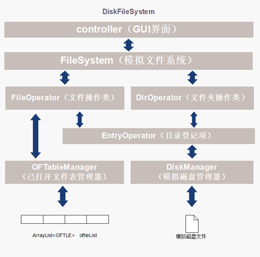

# DiskFileSystem

#### 介绍
Scau文件管理系统

#### 使用说明
- 运行 src/main/java/application/Main.java

#### 软件架构
###### 设计了分层的软件架构，其中每一层都向上层提供服务，同时依赖于下层的实现。

- Entity 层
    - 作用：定义系统中的核心实体，Entry, Pointer, OFLE 。
    - 解耦合：实体层只关心数据的结构和状态，不涉及业务逻辑或数据存取逻辑。
- Enum 层
    - 作用：定义枚举类型，如 BlockStatus, EntryAttribute 等，用于系统中的各种状态和属性。
    - 解耦合：通过枚举类型，提供了一组命名的常量，避免了数字的直接使用，使得代码更加清晰和易于维护。
- Manager 层
    - 作用：管理资源和业务逻辑， DiskManager, OFTableManager。
    - 解耦合：这一层封装了对底层资源（如磁盘块管理）的操作，向上层提供操作这些资源的方法。
- Service 层
    - 作用：封装业务逻辑，EntryOperator, FileDirOperator, DirOperator， FileSystem。
    - 解耦合：这一层EntryOperator使用 Manager 层提供的接口来实现对目录登记项的操作，
    - 然后FileDirOperator和DirOperator再利用EntryOperator提供的功能进行进一步业务逻辑的设计，不直接依赖于具体的数据存取和资源管理细节，
    - 最后FileSystem整合FileDirOperator和DirOperator的各种方法，并做出异常捕获处理，向上层提供对文件或文件夹的操作服务。
- Controller 层
    - 作用：处理用户输入，调用FileSystem的方法，并返回结果。
    - 解耦合：Controller 层作为用户界面和后端逻辑之间的桥梁，它不包含业务逻辑，而是调用 Service 层的方法。

